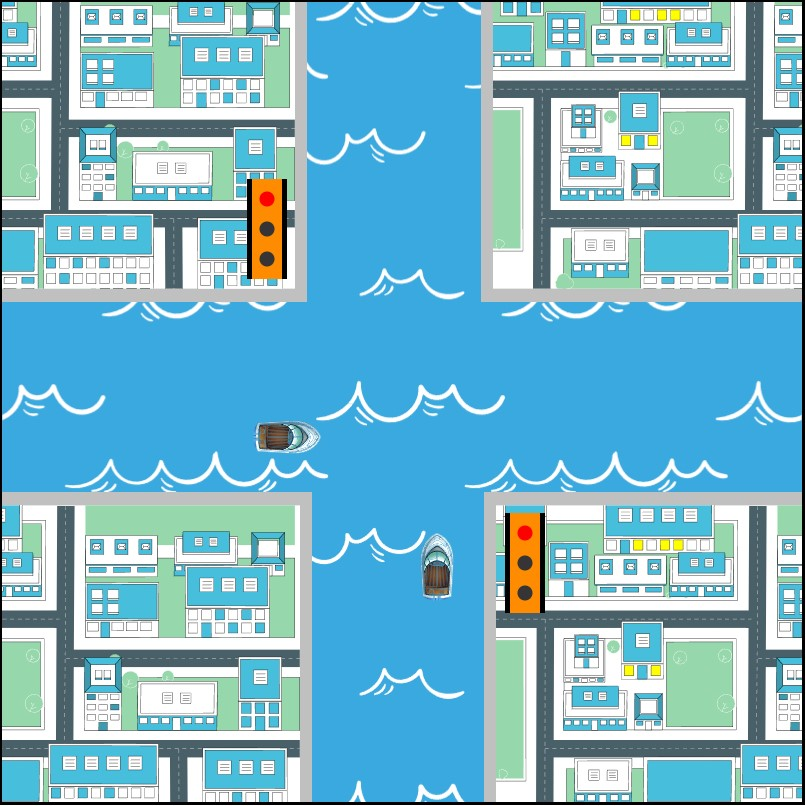
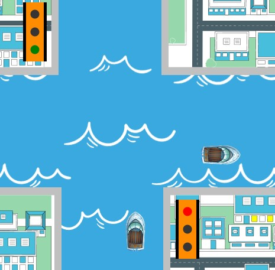

<h1 align="center">
    Ship Traffic
</h1>

## 💻 Sobre o projeto

Projeto que consiste em uma animação do funcionamento de um sinaleiro para navios, o qual foi realizado durante o curso de Engenharia de Computação na disciplina de Computação Gráfica..

---

## ⚙️ Funcionalidades

- Barcos se movem aleatoriamente nos sentidos
- Animação Infinita
- Sinalizador simulando funcionamento de semafaros reais.
- Barcos em SVG
- Montagem do cenário em SVG

---

## 📷 Imagens do projeto

  

  

---

## 🚀 Como executar o projeto

Executar o html ship-traffic.

---

## 🛠 Tecnologias utilizadas

Foram utilizadas as seguintes ferramentas: HTML, CSS, Javascript, Svg.js

---

## 👨‍💻 Autor
 
 <b>Lucas Lima</b>
  
 
---
